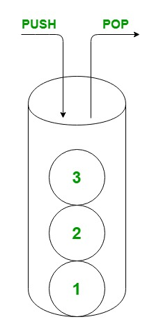

# Ôn lại thuật toán cho phỏng vấn cũng như cũng cố tư duy trong lập trình.

## JavaScript

1. array
2. callback function, hof , closure
3. 4 ways to use function
- pass them to other function
- store a variable
- set them as property of object

3. OOP
- encapsulation
- inheritance
- polymorphism
- abstraction

4. Rest Api

- REST is (Representation Sate Transfer) is a basiclly convention for building http services
- A simple https principle includes: CREATE, READ, UPDATE, DELETE ---> CRUD operator
- All the address can start with http or https, if you want to be exchanged on a secure, you should use https
- architecture url: https://nguyenhuy.com/api/customers --> https: http protocol, nguyenhuy.com: domain, api: subdomain, customers: which refer to collection of customer in our application.
- To get endpoint using http method to request into a server: GET, POST, PUT, DELETE
    - GET api/customers --> send me list customers
    - GET api/customers/1 --> send me a customer
    - UPDATE(PUT) api/customers/1 --> update a customer
    - DELETE(PUT) api/customers/1 --> delete a customer
    - CREATE{POST} api/customres, includes data --> create a customer


## STACK

1. I am using C#
```
Stack.cs
class Stack<T>
{
    int current = -1; 
    T[] items; // craete an array

    public Stack(int size) // create constructor
    {
        items = new T[size]; // create the size of array
    }

    public bool Empty => current == -1; // check empty
    public bool Full => current == items.Length - 1; // the current

    public bool Push(T item)
    {
        if (!Full)
        {
            items[++current] = item; // ++items the value of x after the operator
            return true;
        }
        return false;
    }

    public T? Pop() => !Empty ? items[current--] : default(T); // --items the value of x before the operator
}
```
2. how to use the Stack<T> class
```
class Program
{
    public static void Main(string[] args)
    {
        var colors = new Stack<string>(3);

        colors.Push("Red");
        colors.Push("Green");
        colors.Push("Blue");

        while (true)
        {
            var color = colors.Pop();

            if (color == null)
            {
                break;
            }

            Console.WriteLine(color);
        }

    }

}
```
3. How it works
- First, create a new instance of the Stack and specify the string as the type with the length of items.
```
var color = new Stack<string>(3);
```
- Second, call ```Push()``` method three times to push ```Green```,```Red```, and ```Blue``` strings into the stack.
```
colors.Push("Red");
colors.Push("Green");
colors.Push("Blue");
```
- Third, pop the string out of the stack until it is empty by calling the Pop() method.
```
while (true)
{
    var color = colors.Pop();

    if (color == null)
    {
        break;
    }

    Console.WriteLine(color);
}
```
