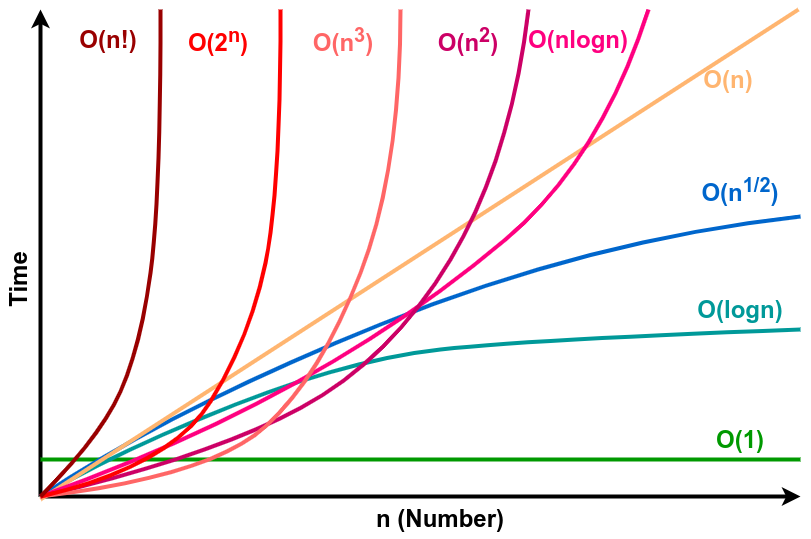

# Reviwe data structure and algorithm.

## Time Complexity


- Link: https://vallicon.com/post/%C4%91%E1%BB%99-ph%E1%BB%A9c-t%E1%BA%A1p-th%E1%BB%9Di-gian-%28time-complexity%29-ar38zOBEwgR

## JavaScript

1. array
2. callback function, hof , closure
3. 4 ways to use function
- pass them to other function
- store a variable
- set them as property of object

3. OOP
- encapsulation
- inheritance
- polymorphism
- abstraction

4. Rest Api

- REST is (Representation Sate Transfer) is a basiclly convention for building http services
- A simple https principle includes: CREATE, READ, UPDATE, DELETE ---> CRUD operator
- All the address can start with http or https, if you want to be exchanged on a secure, you should use https
- architecture url: https://nguyenhuy.com/api/customers --> https: http protocol, nguyenhuy.com: domain, api: subdomain, customers: which refer to collection of customer in our application.
- To get endpoint using http method to request into a server: `GET`,`POST`, `PUT`, `DELETE`
    - GET `api/customers` --> send me list customers
    - GET `api/customers/1` --> send me a customer
    - UPDATE(PUT)`api/customers/1` --> update a customer
    - DELETE(PUT) `api/customers/1` --> delete a customer
    - CREATE{POST} `api/customres` includes data --> create a customer


## STACK

### I am using C#
```
Stack.cs
class Stack<T>
{
    int current = -1; 
    T[] items; // craete an array

    public Stack(int size) // create constructor
    {
        items = new T[size]; // create the size of array
    }

    public bool Empty => current == -1; // check empty
    public bool Full => current == items.Length - 1; // the current

    public bool Push(T item)
    {
        if (!Full)
        {
            items[++current] = item; // ++items the value of x after the operator
            return true;
        }
        return false;
    }

    public T? Pop() => !Empty ? items[current--] : default(T); // --items the value of x before the operator
}
```
2. how to use the ` Stack<T>` class
```
class Program
{
    public static void Main(string[] args)
    {
        var colors = new Stack<string>(3);

        colors.Push("Red");
        colors.Push("Green");
        colors.Push("Blue");

        while (true)
        {
            var color = colors.Pop();

            if (color == null)
            {
                break;
            }

            Console.WriteLine(color);
        }

    }

}
```
3. How it works
- First, create a new instance of the Stack and specify the string as the type with the length of items.
```
var color = new Stack<string>(3);
```
- Second, call ```Push()``` method three times to push ```Green```,```Red```, and ```Blue``` strings into the stack.
```
colors.Push("Red");
colors.Push("Green");
colors.Push("Blue");
```
- Third, pop the string out of the stack until it is empty by calling the ```Pop()``` method.
```
while (true)
{
    var color = colors.Pop();

    if (color == null)
    {
        break;
    }

    Console.WriteLine(color);
}
```
### I am usting JavaScript
```

    class Stack {
        constructor() {
            this.items = [];
        }

        // 1 - Push()

        push(element) {
            return this.items.push(element);
        }
        
        //2 - Pop()
        pop() {
            if (this.items.length === 0) { // if stack is empty 
                return "Underflow";
            }
            return this.items.pop(); // remove the last element --> top element in stack
        }
        
        //3 - Peek() 
        peek() {
            return this.items[this.items.length - 1]; //Return the top most element without removing it from the stack.
        }
        
        // Check empty
        isEmpty() { // return true if stack is empty
            return this.items.length == 0;
        }
        
        // printStack function
        printStack() {
            var str = "";
            for (var i = 0; i < this.items.length; i++)
                str += this.items[i] + " ";
            return str;
        }

    }
    // creating object for stack class
    var stack = new Stack();

    // testing isEmpty and pop on an empty stack

    // returns false
    console.log(stack.isEmpty());

    // returns Underflow
    console.log(stack.pop());

    // Adding element to the stack
    stack.push(10);
    stack.push(20);
    stack.push(30);

    // Printing the stack element
    // prints [10, 20, 30]
    console.log(stack.printStack());

    // returns 30
    console.log(stack.peek());

    // returns 30 and remove it from stack
    console.log(stack.pop());

    // returns [10, 20]
    console.log(stack.printStack());
```

### Bubble sort
```
// bubble sorts array by comparing adjacent elements and swaps them if they are not in the intended order

/*
How Bubble-sort works
We have an unsorted array arr = [ 1, 4, 2, 5, -2, 3 ] the task is to sort the array using bubble sort. 

Bubble sort compares the element from index 0 and if the 0th index is greater than 1st index then the 
values get swapped and if the 0th index is less than the 1st index then nothing happens.

then, the 1st index compares to the 2nd index then the 2nd index compares to the 3rd, and so on…
*/


// Bubble sort Implementation using Javascript

function BBSort(arr) {

    var i, j;
    var len = arr.length;
    var isSwapped = false;

    for (i = 0; i < len; i++) {
        isSwapped = false;
        console.log({ i });

        for (j = 0; j < len; j++) {
            console.log({ j });

            if (arr[j] > arr[j + 1]) {

                var temp = arr[j]
                arr[j] = arr[j + 1];
                arr[j + 1] = temp;
                console.log(arr[j], arr[j + 1]); 
                console.log(arr);
                isSwapped = true;
            }
        }
        // IF no two elements were swapped by inner loop, then break
        if (!isSwapped) {
            break;
        }
    }
    // Print the array
    return arr;
}

var arr = [243, 45, 23, 356, 3, 5346, 35, 5];
console.log(
    BBSort(arr)
);

// IMPLEMENT BY C#
namespace _algorithm;
using MyNameSpace;
using MyNameSpace.Abc;
using SanPham;
using static System.Console;
using System.Linq;
using MyLib;
using MyException;
using System.Collections.Generic;

class Program
{
    // An optimized version of Bubble Sort
    static void bubbleSort(int[] arr, int n)
    {
        int i, j, temp;
        bool swapped;

        for (i = 0; i < n - 1; i++)
        {
            WriteLine(i);
            swapped = false;

            for (j = 0; j < n - i - 1; i++)
            {
                WriteLine(j);
                if (arr[j] > arr[j + 1])
                {
                    //swap arr[i] and arr[j+1]
                    temp = arr[i];
                    arr[j] = arr[j + 1];
                    arr[j + 1] = temp;

                    WriteLine(arr[i], arr[j + 1]);

                    swapped = true;
                }
            }
            // IF no two elements were
            // swapped by inner loop, then break
            if (swapped == false)
            {
                break;
            }
        }
    }

    static void printArray(int[] arr, int size)
    {
        int i;
        for (i = 0; i < size; i++)
        {
            WriteLine(arr[i] + " ");
            WriteLine();
        }
    }
    static void Main(string[] args)
    {

        int[] arr = { 64, 34, 25, 12, 22, 11, 90 };
        int n = arr.Length;
        bubbleSort(arr, n);
        Console.WriteLine("Sorted array");
        printArray(arr, n);
    }


}
}


// VISUALIZATION 

// { i: 0 }
// { j: 0 }
// 45 243
// [
//    45, 243,   23,
//   356,   3, 5346,
//    35,   5
// ]
// { j: 1 }
// 23 243
// [
//    45, 23,  243,
//   356,  3, 5346,
//    35,  5
// ]
// { j: 2 }
// { j: 3 }
// 3 356
// [
//   45,  23,  243,
//    3, 356, 5346,
//   35,   5
// ]
// { j: 4 }
// { j: 5 }
// 35 5346
// [
//     45,  23, 243,
//      3, 356,  35,
//   5346,   5
// ]
// { j: 6 }
// 5 5346
// [
//   45,   23, 243,
//    3,  356,  35,
//    5, 5346
// ]
// { j: 7 }
// { i: 1 }
// { j: 0 }
// 23 45
// [
//   23,   45, 243,
//    3,  356,  35,
//    5, 5346
// ]
// { j: 1 }
// { j: 2 }
// 3 243
// [
//    23,   45,  3,
//   243,  356, 35,
//     5, 5346
// ]
// { j: 3 }
// { j: 4 }
// 35 356
// [
//    23,   45,   3,
//   243,   35, 356,
//     5, 5346
// ]
// { j: 5 }
// 5 356
// [
//    23,   45, 3,
//   243,   35, 5,
//   356, 5346
// ]
// { j: 6 }
// { j: 7 }
// { i: 2 }
// { j: 0 }
// { j: 1 }
// 3 45
// [
//    23,    3, 45,
//   243,   35,  5,
//   356, 5346
// ]
// { j: 2 }
// { j: 3 }
// 35 243
// [
//    23,    3, 45,
//    35,  243,  5,
//   356, 5346
// ]
// { j: 4 }
// 5 243
// [
//    23,    3,  45,
//    35,    5, 243,
//   356, 5346
// ]
// { j: 5 }
// { j: 6 }
// { j: 7 }
// { i: 3 }
// { j: 0 }
// 3 23
// [
//     3,   23,  45,
//    35,    5, 243,
//   356, 5346
// ]
// { j: 1 }
// { j: 2 }
// 35 45
// [
//     3,   23,  35,
//    45,    5, 243,
//   356, 5346
// ]
// { j: 3 }
// 5 45
// [
//     3,   23,  35,
//     5,   45, 243,
//   356, 5346
// ]
// { j: 4 }
// { j: 5 }
// { j: 6 }
// { j: 7 }
// { i: 4 }
// { j: 0 }
// { j: 1 }
// { j: 2 }
// 5 35
// [
//     3,   23,   5,
//    35,   45, 243,
//   356, 5346
// ]
// { j: 3 }
// { j: 4 }
// { j: 5 }
// { j: 6 }
// { j: 7 }
// { i: 5 }
// { j: 0 }
// { j: 1 }
// 5 23
// [
// { j: 6 }
// { j: 7 }
// [
//     3,    5,  23,
//    35,   45, 243,
//   356, 5346
// ]

```
